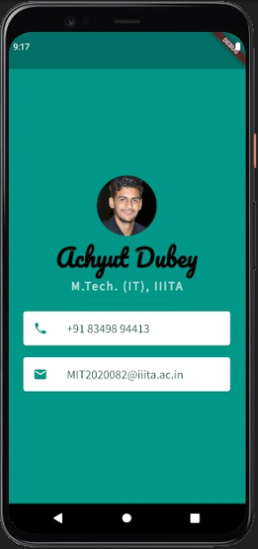

## Visiting Card UI

**Learnings:**
- Creating Stateless Widgets
- Difference between hot reload and hot refresh and running an app from cold
- Use Containers to lay out your UI
- Columns and Rows to position your UI elements
- Add custom fonts
- Add Material icons
- Style Text widgets
- Read and use Flutter Documentation

**Output Screenshot:**

### Flutter is Google’s UI toolkit for building beautiful, natively compiled applications for mobile, web, and desktop from a single codebase.
